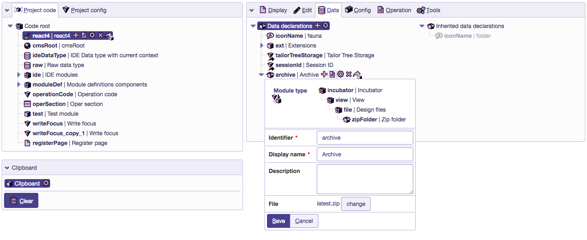

Export do Bloxov
================

Pri vývoji
----------

Príkaz ```npm run publish``` vytvorí archív a uploadne ho na server, kde je aktuálne k dispozícií pre používanie.

Pred nasadením
--------------

Po nasadení projektu, archív nahratý cez ```npm run publish``` NIE JE možné použiť, t.j. archív ktorý sa nachádza v dátovej časti modulu bude použitý ako aktuálny. Preto je potrebné pred každým nasadením nahrať nový archív do dátovej časti.

1. Vytvorenie archívu pre nahratie
    – ```npm run prepublish```
    - v priečinku ```archive``` vytvorí ZIP súbor s aktuálnym dátumom a časom, napr. ```2017-10-09-15-54-35.zip```
4. Upload archívu do dizajnu
